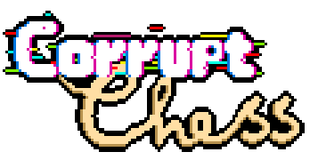
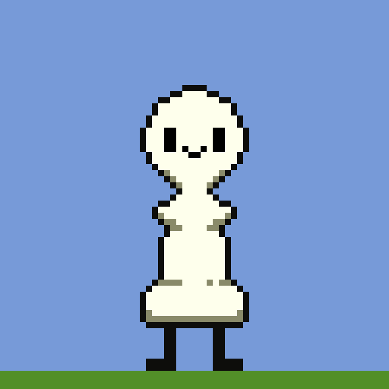

# Chess Game

I [CHESS_GAME] spiller du som en sjakkbrikke som har som mål å redde sin konge frå mostanderen.
for å gjøre dette må du gå igjennom en rekke "levels" med farlige fiender og hindringer.
Redd kongen din ved hjelp av en rekke ulike transformasjoner, som hver gir deg en litt spesiell evne.

## Spillets - Status
Spillet er forsatt godt under utvikling, og bruker placeholder-grafikk medan det blir lagd aktuell grafikk for spillet.
Multiplayeren er godt under utvikling og kan bli lagd til fortløpende.
Noen levels er planlagd, men grunna usikkerhet rundt hvilke features vi har ferdigstilt og vil bruke videre.

## How to run
Pull prosjektet frå git ved bruk av clone knappen. velg din prefererte metode (SSH / HTTPS).
For å så starte programmet runner du Main.java, ettersom programmet enda ikkje er exportet må dette gjøres med en IDE.

## Trello
Vi bruker Trello til fordeling av oppgåver og som en sjekkliste for prosjektet.
Link:
https://trello.com/invite/b/toDOLHwu/2e8eeb822e39ff808d991dd147805219/obligatorisk-oppg%C3%A5ve-1

## Medlemmer
- Emil Bruland : Gruppeleder og ansvarlig for organisering av arbeidsoppgåver.
- Åsmund Almenning : Test-ansvarlig og Hovud-ansvar for GUI elementer.
- Johnarthan Amalathas : Grafisk-designer og Hovud-ansvar for MultiPlayer.
- Olaug Rusnes : Skrive-ansvarlig, Level-designer og medarbeider på MultiPlayer.
- Thorgal Blanco : Kode-ansvarlig og kvalitets-ansvarlig.
- Mikal Drivenes : Koding og arbeid med Entities.
